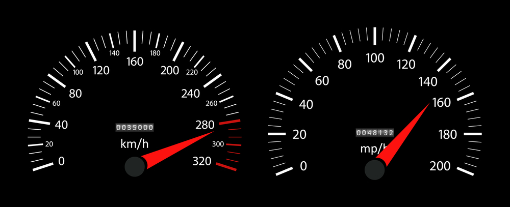

# <u>**Miles to Kilometers Conversion Project**</u>

## A project to convert miles into kilometers.  

This Project is focused on creating a converter that converts units of miles 
into kilometers using the Tkinter module of python.   

    

### <u>**Libraries Used:**</u>  
Tkinter 

### <u>**Project:**</u>  
Miles to Kilometers Conversion Project 
100 Days of Code - The Complete Python Pro Bootcamp 2021  
Day 27 - Intermediate - Tkinter, *args, **kwargs and Creating GUI Programs